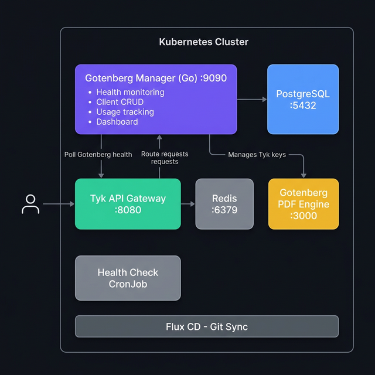

# Flux-Tyk-Gotenberg

A production-ready, GitOps-driven **PDF generation platform** built on Kubernetes. It combines [Gotenberg](https://gotenberg.dev/) as the conversion engine, [Tyk](https://tyk.io/) as the API gateway, and a custom **Gotenberg Manager** app for client management, usage tracking, and monitoring — all deployed declaratively with [Flux CD](https://fluxcd.io/).

---

## Table of Contents

1. [Architecture](#architecture)
2. [Project Structure](#project-structure)
3. [Components](#components)
4. [Quick Start](#quick-start)
5. [Gotenberg Manager](#gotenberg-manager)
6. [API Reference](#api-reference)
7. [Daily Operations](#daily-operations)
8. [Disaster Recovery](#disaster-recovery)

---

## Architecture



### Traffic Flow


1. The user opens a `kubectl port-forward` bridge to the Tyk Gateway on port `8080`.
2. Tyk receives the request (e.g., `POST /pdf/forms/chromium/convert/url`), matches it to the `gotenberg-v1` API definition, validates the API key.
3. Tyk strips the `/pdf/` prefix and proxies the request to `http://gotenberg.gotenberg.svc.cluster.local:3000/`.
4. Gotenberg renders the content using Chromium or LibreOffice and generates the PDF in memory.
5. The PDF binary streams back through Tyk to the user.

---

## Project Structure

```
flux-tyk-gotenberg/
├── apps/
│   ├── gotenberg/                 # PDF conversion engine
│   │   ├── deployment.yaml
│   │   └── kustomization.yaml
│   ├── tyk/                       # API Gateway + Redis
│   │   ├── gateway.yaml
│   │   ├── redis.yaml
│   │   ├── namespace.yaml
│   │   └── kustomization.yaml
│   ├── tyk-apis/                  # API route definitions
│   │   ├── gotenberg-api.yaml
│   │   └── kustomization.yaml
│   ├── health-check/              # CronJob pipeline validator
│   │   ├── cronjob.yaml
│   │   ├── namespace.yaml
│   │   └── kustomization.yaml
│   └── gotenberg-manager/         # ★ Management app (Go)
│       ├── cmd/server/main.go
│       ├── internal/              # Services, handlers, middleware
│       ├── web/                   # Dashboard templates + CSS
│       ├── migrations/            # PostgreSQL schema
│       ├── k8s/                   # Kubernetes manifests
│       ├── Dockerfile
│       ├── docker-compose.yml
│       └── WALKTHROUGH.md
├── clusters/my-cluster/           # Flux sync definitions
│   ├── infra-tyk-sync.yaml
│   ├── apps-gotenberg-sync.yaml
│   ├── tyk-apis-sync.yaml
│   ├── health-check-sync.yaml
│   └── gotenberg-manager-sync.yaml
└── assets/                        # Architecture diagrams
```

---

## Components

### 1. Gotenberg (`apps/gotenberg`)

The PDF conversion engine — a stateless Docker API powered by Chromium and LibreOffice.

| Property | Value |
|---|---|
| Image | `gotenberg/gotenberg:8` |
| Port | `3000` |
| Namespace | `gotenberg` |

### 2. Tyk API Gateway (`apps/tyk`)

The entry point for all PDF requests. Handles authentication, rate limiting, and routing.

| Property | Value |
|---|---|
| Image | `tykio/tyk-gateway:v5.3.0` |
| Port | `8080` |
| Auth | Standard auth (`use_keyless: false`) |
| Redis | `redis:6-alpine` on port `6379` |
| Namespace | `tyk` |

API definitions are loaded from ConfigMaps (`apps/tyk-apis/`) and mounted into `/opt/tyk-gateway/apps`.

### 3. Health Check (`apps/health-check`)

A Kubernetes CronJob that validates the full pipeline every 5 minutes. It mints a temporary API key, sends a PDF conversion request through Tyk, and verifies an HTTP 200 response.

### 4. Gotenberg Manager (`apps/gotenberg-manager`)

A **Go application** providing centralized management for the PDF platform. See the [dedicated section](#gotenberg-manager) below.

### 5. GitOps — Flux CD (`clusters/my-cluster/`)


Flux reconciles the cluster state against this Git repository every minute through 5 Kustomization resources:

| Sync File | Target | Dependencies |
|---|---|---|
| `infra-tyk-sync.yaml` | `apps/tyk/` | — |
| `apps-gotenberg-sync.yaml` | `apps/gotenberg/` | — |
| `tyk-apis-sync.yaml` | `apps/tyk-apis/` | — |
| `health-check-sync.yaml` | `apps/health-check/` | infra-tyk, apps-gotenberg |
| `gotenberg-manager-sync.yaml` | `apps/gotenberg-manager/k8s/` | infra-tyk, apps-gotenberg |

> **Note:** There is an occasional race condition where Tyk boots before the API ConfigMap is injected. A `kubectl rollout restart deployment tyk-gateway -n tyk` resolves it.

---

## Quick Start

### Option A: Docker Compose (local development)

The fastest way to get the entire stack running locally:

```bash
cd apps/gotenberg-manager
docker compose up --build -d
```

This starts **5 services**: PostgreSQL, Gotenberg, Tyk Gateway, Redis, and Gotenberg Manager.

| Service | URL |
|---|---|
| Gotenberg Manager Dashboard | http://localhost:9090/dashboard |
| Gotenberg Manager API | http://localhost:9090/api/ |
| Health Check | http://localhost:9090/health |
| Tyk Gateway | http://localhost:8080 |
| Gotenberg (direct) | http://localhost:3000 |

### Option B: Kubernetes with Flux

```bash
# 1. Bootstrap Flux
flux bootstrap github \
  --owner=AGarciaRipalda \
  --repository=flux-tyk-gotenberg \
  --branch=main \
  --path=./clusters/my-cluster \
  --personal

# 2. Wait for reconciliation
flux get kustomizations -w

# 3. Fix the Tyk startup race condition
kubectl rollout restart deployment tyk-gateway -n tyk

# 4. Port-forward to access
kubectl port-forward svc/gotenberg-manager 9090:9090 -n gotenberg-manager
kubectl port-forward deployment/tyk-gateway 8080:8080 -n tyk
```

---

## Gotenberg Manager

A custom **Go microservice** that adds client management, usage tracking, and real-time health monitoring to the platform.

### Features

| Feature | Description |
|---|---|
| 🏥 **Health Monitoring** | Background goroutine polls Gotenberg `/health` every 30s, stores history in DB |
| 👥 **Client Management** | Full CRUD with API key generation, plan assignment, and activation/deactivation |
| 🔑 **Tyk Integration** | Auto-creates/deletes API keys in Tyk when managing clients |
| 📊 **Usage Tracking** | Per-client counters: today, this month, total — with configurable monthly limits |
| 🖥️ **Web Dashboard** | Dark-themed admin panel with stats cards, progress bars, and activity tables |
| 🔐 **Security** | Admin API protected by Bearer token; clients identified by unique API keys |

### Tech Stack

| Layer | Technology |
|---|---|
| Language | Go 1.22 |
| Router | chi v5 |
| Database | PostgreSQL 16 (via pgx) |
| Templates | Go `html/template` |
| Container | Multi-stage Docker (~20 MB) |

### Plans & Limits

| Plan | Monthly PDF Limit |
|---|---|
| `free` | 100 |
| `starter` | 1,000 |
| `pro` | 10,000 |
| `enterprise` | 100,000 |

### Configuration

All settings are controlled via environment variables:

| Variable | Default | Description |
|---|---|---|
| `PORT` | `9090` | Server port |
| `DATABASE_URL` | `postgres://...` | PostgreSQL connection string |
| `GOTENBERG_URL` | `http://localhost:3000` | Gotenberg base URL |
| `TYK_URL` | `http://localhost:8080` | Tyk Gateway base URL |
| `TYK_ADMIN_KEY` | `foo` | Tyk admin secret |
| `ADMIN_TOKEN` | `admin-secret` | Bearer token for REST API auth |
| `HEALTH_CHECK_INTERVAL` | `30` | Seconds between health polls |

> For detailed component documentation, see [`apps/gotenberg-manager/WALKTHROUGH.md`](apps/gotenberg-manager/WALKTHROUGH.md).

---

## API Reference

### Public Endpoints

| Method | Endpoint | Description |
|---|---|---|
| `GET` | `/health` | Consolidated health status (app + Gotenberg + DB) |
| `GET` | `/dashboard` | Admin web dashboard |

### Protected Endpoints (require `Authorization: Bearer <ADMIN_TOKEN>`)

| Method | Endpoint | Description |
|---|---|---|
| `GET` | `/api/clients` | List all clients |
| `POST` | `/api/clients` | Create a new client |
| `GET` | `/api/clients/{id}` | Get client details |
| `PUT` | `/api/clients/{id}` | Update a client |
| `DELETE` | `/api/clients/{id}` | Delete a client |
| `POST` | `/api/clients/{id}/rotate-key` | Rotate client API key |
| `GET` | `/api/clients/{id}/usage` | Get client usage statistics |
| `GET` | `/api/usage/summary` | Global usage summary |

### Example: Create a Client

```bash
curl -X POST http://localhost:9090/api/clients \
  -H "Authorization: Bearer admin-secret" \
  -H "Content-Type: application/json" \
  -d '{"name":"Acme Corp","email":"admin@acme.com","plan":"pro"}'
```

### Example: Generate a PDF via Tyk

```bash
# 1. Mint an API key
curl -X POST -H "x-tyk-authorization: foo" -s \
  -H "Content-Type: application/json" \
  -d '{
    "allowance": 1000, "rate": 100, "per": 60,
    "expires": -1, "quota_max": -1, "org_id": "default",
    "access_rights": {
      "gotenberg-v1": {
        "api_id": "gotenberg-v1",
        "api_name": "Gotenberg PDF API",
        "versions": ["Default"]
      }
    }
  }' http://localhost:8080/tyk/keys/create

# 2. Use the key to convert a URL to PDF
curl -X POST http://localhost:8080/pdf/forms/chromium/convert/url \
  -H "Authorization: <YOUR_KEY>" \
  -F url="https://example.com" \
  -o output.pdf
```

---

## Daily Operations

### Morning Startup (Kubernetes)

```bash
# 1. Check all pods are running
kubectl get pods -A | grep -E "tyk|gotenberg"

# 2. Open the Tyk tunnel (keep running)
kubectl port-forward deployment/tyk-gateway 8080:8080 -n tyk

# 3. Open the Manager tunnel (keep running)
kubectl port-forward svc/gotenberg-manager 9090:9090 -n gotenberg-manager

# 4. Open the dashboard
open http://localhost:9090/dashboard
```

### Morning Startup (Docker Compose)

```bash
cd apps/gotenberg-manager
docker compose up -d
open http://localhost:9090/dashboard
```

---

## Disaster Recovery

> Run this **only** if the Kubernetes cluster is completely destroyed and needs rebuilding from zero.

```bash
# 1. Reinstall Flux and link to GitHub
flux bootstrap github \
  --owner=AGarciaRipalda \
  --repository=flux-tyk-gotenberg \
  --branch=main \
  --path=./clusters/my-cluster \
  --personal

# 2. Watch the cluster rebuild
flux get kustomizations -w
# Wait until all show "True", then Ctrl+C

# 3. Fix the Tyk startup race condition
kubectl rollout restart deployment tyk-gateway -n tyk
# Wait 15 seconds, then follow "Morning Startup" above
```
