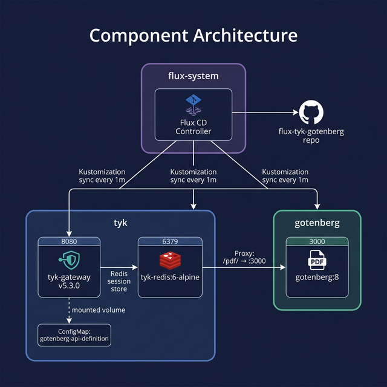
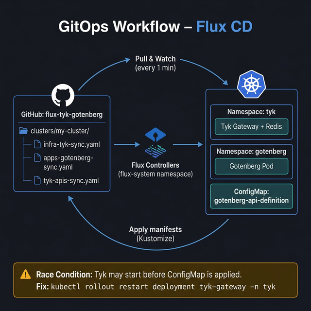
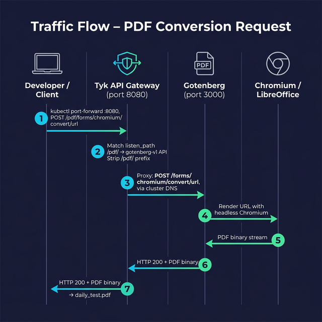

# Flux-Tyk-Gotenberg

This project provides a GitOps-based Kubernetes deployment using [Flux](https://fluxcd.io/) to manage a [Tyk API Gateway](https://tyk.io/) and [Gotenberg](https://gotenberg.dev/) (a developer-friendly API for PDF conversion). 

## Project Structure

- `apps/`: Contains the base manifests for the different components.
  - `gotenberg/`: Deployments and services for the Gotenberg PDF converter.
  - `tyk/`: Deployments and services for the Tyk API Gateway and Redis.
  - `tyk-apis/`: Tyk API configurations (ConfigMaps).
  - `health-check/`: CronJob that periodically verifies the Tyk-Gotenberg pipeline.
- `clusters/my-cluster/`: Flux kustomization manifests connecting the GitHub repository to the local cluster deployment.

---

## Infrastructure and Architecture Overview

This document provides a technical explanation of the current state of the project and how its infrastructure components work together.

### System Overview

The project implements a GitOps-driven Kubernetes architecture managed by **Flux CD**. The system consists of an API Gateway (**Tyk**) that manages and proxies traffic to a backend PDF conversion engine (**Gotenberg**). The complete deployment lifecycle, from foundational infrastructure to application configuration, is managed declaratively through Kubernetes manifests stored in this Git repository.

### Component Architecture



The infrastructure is logically separated into three main application domains located in the `apps/` directory:

#### 1. Gotenberg (`apps/gotenberg`)
Gotenberg is a Docker-powered stateless API for PDF conversion.
- **Deployment**: Runs a single replica of the `gotenberg/gotenberg:8` image.
- **Service**: Exposed internally within the cluster on port `3000`.
- **Namespace**: `gotenberg`

#### 2. Tyk API Gateway & Redis (`apps/tyk`)
Tyk acts as the primary entry point and API management layer. It requires a Redis instance for caching, rate limiting, and analytics.
- **Tyk Gateway**:
  - Runs `tykio/tyk-gateway:v5.3.0`.
  - Exposed via a Kubernetes Service on port `8080`.
  - Configured via environment variables to connect to Redis (`TYK_GW_REDIS_HOST="tyk-redis"`).
  - Dynamically mounts API definitions directly from a Kubernetes ConfigMap.
  - **Namespace**: `tyk`
- **Tyk Redis**:
  - Runs a lightweight `redis:6-alpine` instance.
  - Exposed internally to the gateway on port `6379`.

#### 3. API Configuration (`apps/tyk-apis`)
Instead of hardcoding APIs into the Tyk Gateway, APIs are defined as Kubernetes ConfigMaps, offering a decoupled configuration approach.
- **`gotenberg-api-definition` ConfigMap**:
  - Defines an API with the ID `gotenberg-v1`.
  - Listens on the path `/pdf/`.
  - Proxies traffic to the internal Gotenberg service using the fully qualified domain name (FQDN): `http://gotenberg.gotenberg.svc.cluster.local:3000/`.
  - Currently configured as requiring an authentication token (secured API, `use_keyless: false`).
  - The `tyk-gateway` Deployment mounts this ConfigMap into the `/opt/tyk-gateway/apps` directory, allowing Tyk to discover the API upon startup.

#### 4. Health Check (`apps/health-check`)
A Kubernetes CronJob that periodically validates the end-to-end PDF generation pipeline.
- **CronJob**: Runs every 5 minutes (`*/5 * * * *`) using the `curlimages/curl` image.
- **Functionality**: Mints a short-lived API key from Tyk using the admin secret, sends a request to convert a dummy URL to PDF via the Gateway, and verifies that the response is HTTP 200 OK. Exit code reports success (0) or failure (1).
- **Namespace**: `health-check`

### GitOps Workflow (Flux CD)



The continuous delivery of the cluster state is managed by Flux CD, configured in `clusters/my-cluster/`. Flux continuously reconciles the cluster state against the GitHub repository.

Three specific `Kustomization` resources drive the synchronization every 1 minute:
1. **`infra-tyk-sync.yaml`**: Targets `./apps/tyk/` to deploy the Tyk Gateway and Redis infrastructure.
2. **`apps-gotenberg-sync.yaml`**: Targets `./apps/gotenberg/` to deploy the PDF conversion engine.
3. **`tyk-apis-sync.yaml`**: Targets `./apps/tyk-apis/` to inject the API definitions into the `tyk` namespace.
4. **`health-check-sync.yaml`**: Targets `./apps/health-check/` to deploy the validation CronJob. It is configured to depend on both the `infra-tyk` and `apps-gotenberg` Kustomizations to ensure the pipeline is deployed before checks run.

*Note: Since these syncs happen in parallel or sequentially depending on Flux's controller loops, there may occasionally be a race condition where the Tyk Gateway boots up before the API ConfigMap is injected. A manual rollout restart of the Tyk deployment resolves this (as detailed in the README).*

### Traffic Flow Request Lifecycle



From a technical point of view, when a user makes a request to convert a PDF, the traffic flow works as follows:

1. **Localhost Ingress**: The user opens a `kubectl port-forward` bridge from their local machine to the Tyk Gateway Pod on port `8080`.
2. **API Gateway Evaluation**: The HTTP request hits Tyk (e.g., `POST http://localhost:8080/pdf/...`). Tyk matches the `/pdf/` path to the `gotenberg-v1` API definition.
3. **Internal Proxying**: Tyk strips the `/pdf/` prefix from the URL path and proxies the modified request to the internal Kubernetes DNS address of the Gotenberg service (`http://gotenberg.gotenberg.svc.cluster.local:3000/`).
4. **Backend Processing**: The Gotenberg pod receives the request, spins up Chromium (or LibreOffice, depending on the route), renders the content, and generates a PDF file in memory.
5. **Response Delivery**: Gotenberg streams the PDF binary back through Tyk, which returns the file to the user over the port-forward tunnel.

---

## Daily Cheat Sheet

Here is the official, battle-tested daily cheat sheet for interacting with this project.

### The Daily Ignition Sequence
*(Run this when you open your laptop and want to generate a PDF)*

**1. Verify the Engine is Running**
Make sure Flux has automatically spun up all your pods (Tyk, Redis, and Gotenberg) and that they say `1/1 Running`:

```bash
kubectl get pods -A | grep -E "tyk|gotenberg"
```

**2. Open the Bridge (Terminal 1)**
Open the direct tunnel from your Mac into the Tyk Gateway pod. *(Leave this terminal running in the background!)*

```bash
kubectl port-forward deployment/tyk-gateway 8080:8080 -n tyk
```

**3. Mint Your VIP Key (Terminal 2)**
Because the API is locked down, generate a fresh access token using your gateway admin secret (`foo`):

```bash
curl -X POST -H "x-tyk-authorization: foo" -s \
-H "Content-Type: application/json" \
-d '{
  "allowance": 1000,
  "rate": 100,
  "per": 60,
  "expires": -1,
  "quota_max": -1,
  "org_id": "default",
  "access_rights": {
    "gotenberg-v1": {
      "api_id": "gotenberg-v1",
      "api_name": "Gotenberg PDF API",
      "versions": ["Default"]
    }
  }
}' http://localhost:8080/tyk/keys/create
```
*(Copy the long alphanumeric string it gives you next to "key":)*

**4. The Golden Request (Terminal 2)**
Fire your PDF rendering command through the Gateway, passing your new key in the `Authorization` header:

```bash
curl -v -X POST http://localhost:8080/pdf/forms/chromium/convert/url \
  -H "Authorization: YOUR_NEW_KEY_HERE" \
  -F url="https://google.com" \
  -o daily_pdf.pdf
```

**5. View the Output**

```bash
open daily_pdf.pdf
```

---

### 🚨 The "Total Disaster" Rebuild Guide
*(Run this ONLY if you completely delete your local Kubernetes cluster and need to rebuild from absolute zero)*

**1. Reinstall Flux and Link to GitHub:**

```bash
flux bootstrap github \
  --owner=AGarciaRipalda \
  --repository=flux-tyk-gotenberg \
  --branch=main \
  --path=./clusters/my-cluster \
  --personal
```

**2. Watch the cluster rebuild itself:**

```bash
flux get kustomizations -w
```
*(Wait until everything says True, then press Ctrl + C).*

**3. Fix the Tyk Startup Race Condition:**
Because Tyk boots up faster than Kubernetes can inject its configuration files, force it to restart so it reads your `gotenberg-api.json` and connects to Redis:

```bash
kubectl rollout restart deployment tyk-gateway -n tyk
```
*(Wait 15 seconds, then follow the "Daily Ignition Sequence" above!)*
